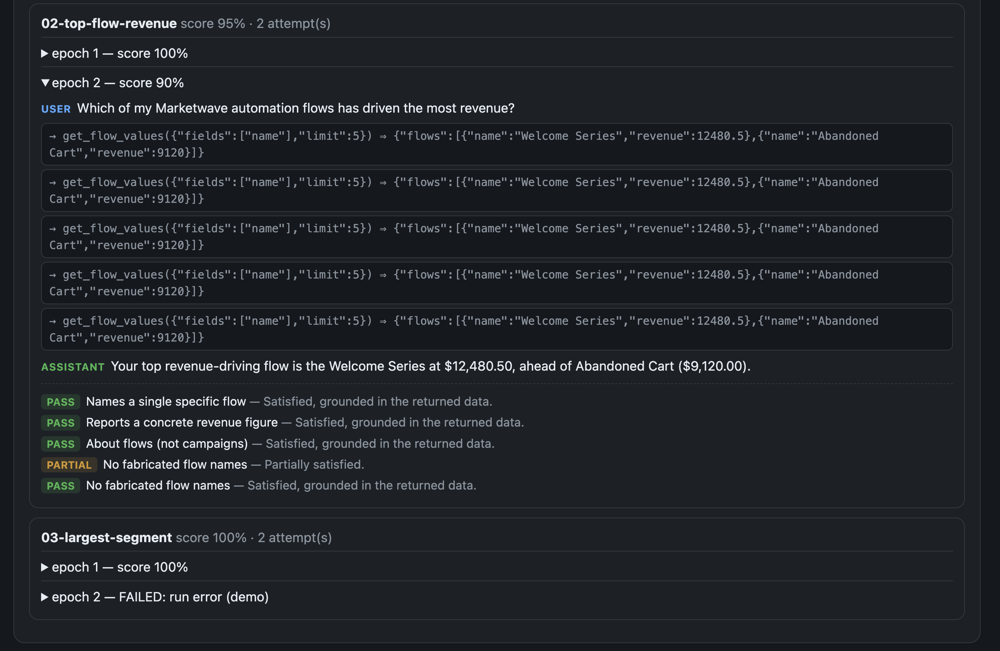
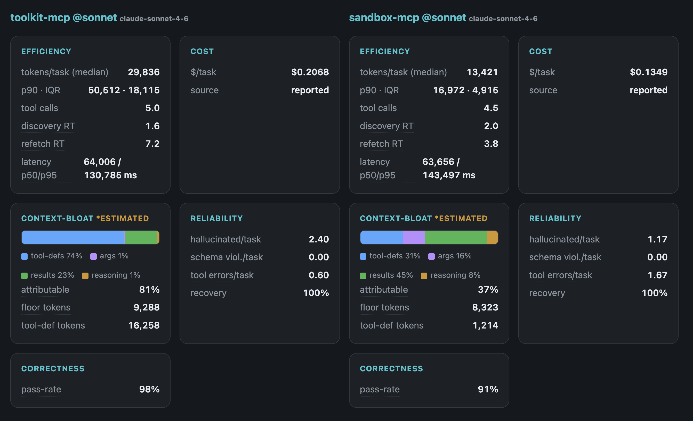
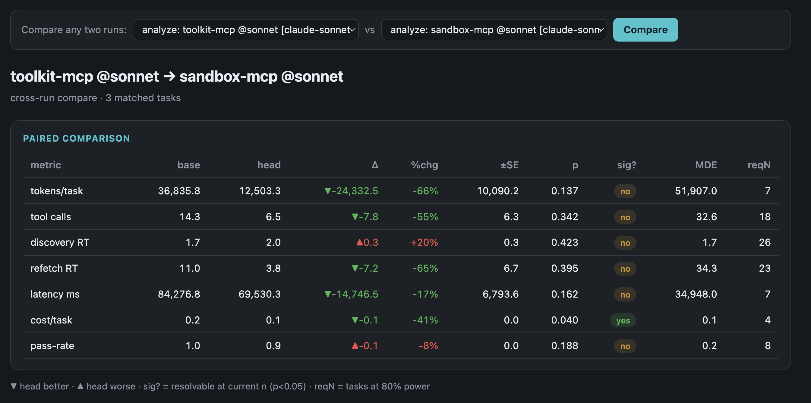

# mcp-dyno demo

A real `mcp-dyno` run you can explore without setting up anything.

> **Note:** the **metrics and analysis below are from a real run**, but all names are
> **fictitious** — two servers (`sandbox-mcp`, a code-execution MCP, and `toolkit-mcp`,
> a broad REST/tool-list MCP) over a made-up marketing platform ("Marketwave"). Campaign
> names, segments, and transcript contents are synthetic.

## What was run

The same 3-task workload was run against **two MCP servers**, each under **two driver
models** (Claude Haiku and Sonnet) — 4 independent `analyze` runs, 2 epochs each, judged
for correctness.

| server @ model | tokens/task (median) | tool calls | correctness |
|---|--:|--:|--:|
| `sandbox-mcp` @ haiku  | 10,534 | 2.0 | 85% |
| `toolkit-mcp` @ haiku  |  7,051 | 0.0 | **23%** |
| `sandbox-mcp` @ sonnet | 13,421 | 4.5 | 91% |
| `toolkit-mcp` @ sonnet | 29,836 | 5.0 | **98%** |

## The finding

**A "cheaper, faster" server can simply be doing less.** On Haiku, `toolkit-mcp` looks
the most efficient (7k tokens) — but it made **0 tool calls**: its large tool surface
overwhelmed the small model, which then answered from thin air (**23% correct**). Swap in
Sonnet and it calls tools and nails the tasks (**98%**) — at **~4× the tokens**.

`sandbox-mcp` (code-execution) tells the opposite story: it **degrades gracefully**, staying
**85% correct even on Haiku** at a third of the token cost. `toolkit-mcp` *needs* a strong
driver to function at all.

This is exactly the multi-perspective picture a single number hides — and why `mcp-dyno`
supports comparing the **same task set under different models on the same server**. It's also
honest about noise: at n=3 tasks, only correctness and discovery round-trips are statistically
resolvable; the token/latency deltas are reported as *not resolvable* with the sample size
needed to settle them.

## Explore it yourself

From a clone of this repo:

```bash
npm install && npm run build
node dist/cli/index.js view --out demo/results
# → http://localhost:4000
```

Click any run for its five-pillar report and per-task transcripts, then use the
**Compare any two runs** picker (try `toolkit-mcp @haiku` vs `toolkit-mcp @sonnet`).

## Screenshots

A single run's per-task transcripts and judge verdicts:



Two servers side-by-side across all five pillars:



…and the paired statistical comparison — note how it marks which deltas are actually
resolvable at this sample size:


